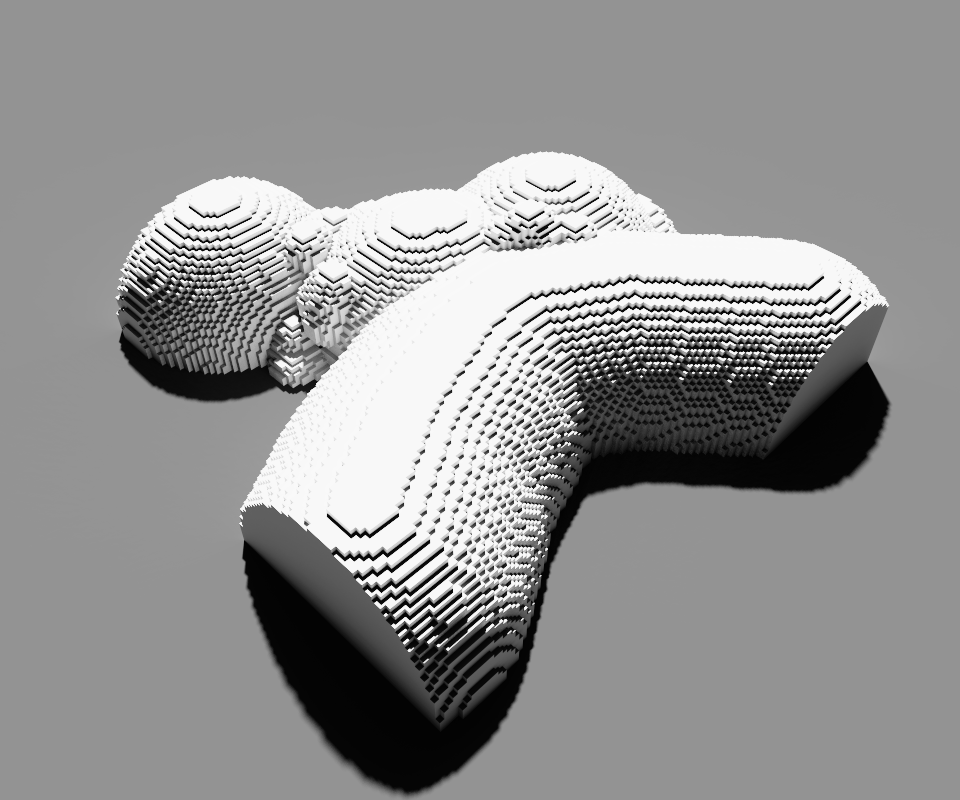
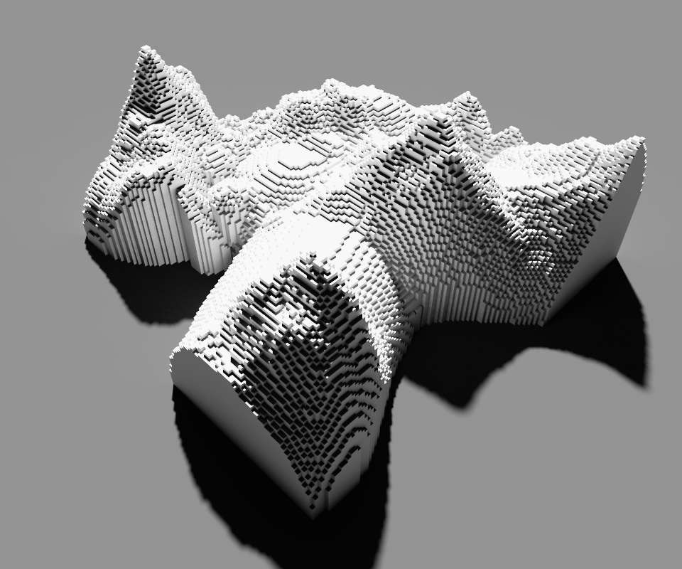

# Eric's MagicaVoxel Shaders
Shaders for MagicaVoxel including Terrain Generator, Advanced Flood System etc.

## Internationalization
- <a href="./i18n/README-sc.md">简体中文</a> - translated by <a href="http://github.com/codingeric">CodingEric</a>, target version: `0.0.9.0`
- <a href="./i18n/README-fr.md">Français</a> - translated by <a href="http://moiscript.weebly.com/magicavoxel.html">Pilou</a> - Authorized reproduce, target version: `0.0.7.0`

## Project Info
* Current version: `0.0.9.5`
* State: `LTS`
* Tested with `MagicaVoxel 0.99.3 for Windows`
* Released under `MIT License`
* Language: `GLSL`

## Installation
Copy the .txt files from the `shader` directory in this project to the `shader` directory of your MagicaVoxel installation.

## Compatibility
>Notice: The compatibility issue in older GLSL versions will be thought of as bugs, please post them in the issues of the project.

| Version | Is compatible | Note |
| ------ | :------: | ------ |
| 0.98.2 | √ | No world system supported |
| 0.99 | √ | Cannot show color id in the command panel |
| 0.99.1 | √ | Cannot show color id in the command panel |
| 0.99.2 | √ | |
| 0.99.3 | √ | |

## Shaders and usages
>**Note**   - The parameters with `<>` can be ignored. Mostly, they are set to 0 as default.    - The shaders are not designed for selected areas without specific explanation.    - The documentation of deprecated/unstable shaders can be found in their folders.
### INDEX
* <a href="#terrain-generator">Terrain generator</a>
* <a href="#terrain-generator-2">Terrain generator 2</a>
* <a href="#flow">Flow</a>
* <a href="#flow2">Flow2</a>
* <a href="#project">Project</a>
* <a href="#life-game">Life game</a>
* <a href="#drop">Drop</a>
* <a href="#cube-filling">Cube filling</a>
### TERRAIN GENERATOR
<a href="#index">back to index</a>
>1. The older version, which cannot execute under some older GLSL versions, has been deprecated. Special thanks to those who reported bugs.
>2. The noise generation method is provided by ashima/webgl-noise: Copyright (C) 2011 Ashima Arts. All rights reserved.
* File name: `tergen.txt`
* Command-line usage: `xs tergen [seed] [altitude] 
[noise-scale] [voxel-color] <void-voxel-color> <vertical-shifting> <x-shifting> <y-shifting>`
* Command-line e.g.: `xs tergen 19260817 40 90 1 -1 10 -50 -10`
* Minimal edition e.g.: `xs tergen 19260817 40 90 1`
>1. It is recommended that you set the scene size to 126x126x126 for the best view.
>2. Set void-voxel-color to -1 to not remove the original scene.
>3. By using the xyz-shifting of the shader & the new *world* system of MagicaVoxel 0.99.x, you'll be able to create a large terrain map. (fig. 3)
* Image preview:

  
### TERRAIN GENERATOR 2
<a href="#index">back to index</a>
>1. In tergen2, the terrain that generated overlays over existing voxels.
>2. The noise generation method is provided by ashima/webgl-noise: Copyright (C) 2011 Ashima Arts. All rights reserved.
* File name: `tergen2.txt`
* Command-line usage: `xs tergen2 [seed] [altitude] 
[noise-scale] [voxel-color] <void-voxel-color> <vertical-shifting> <x-shifting> <y-shifting>`
* Command-line e.g.: `xs tergen2 19260817 16 70 1 -1 -10 -50 -10`
* Minimal edition e.g.: `xs tergen2 19260817 16 70 1`
>Set void-voxel-color to -1 to not remove the original scene.
* Image preview:

  
### FLOW
<a href="#index">back to index</a>
> This shader emulates the waterflow mechanics in the nature.
* File name: `flow.txt`
* Command-line usage: `xs flow [color-index]`
* Command-line e.g.: `xs flow 1`
> The voxels with given index are water source, the shader would not automatically create them, you must attach them first.
* Image preview:

  
### FLOW2
<a href="#index">back to index</a>
> In fact, it's a replacement of the unstable `hyperflood` shader. In the fig.2 of preview section, you can see the shader does provide a solution for the closed areas.
* File name: `flow2.txt`
* Command-line usage: `xs flow2 [color-index]`
* Command-line e.g.: `xs flow2 1`
> The voxels with given index are water source, the shader would not automatically create them, you must attach them first.
* Image preview:

  
  

### PROJECT
<a href="#index">back to index</a>
>Project the color of a given x-y plane to the suface under it.
* File name: `project.txt`
* Command-line usage: `xs project [height]`
* Command-line e.g.: `xs project 64`
>
* Image preview:

  
  
  
### LIFE GAME
<a href="#index">back to index</a>
* File name: `lifegame.txt`
* Command-line usage: `xs lifegame [color-index]`
* Command-line e.g.: `xs lifegame 1`
> Designed for x-y plane. Use single color in your scene, or the shader will destroy it.
* Image preview:

  
  
  
### DROP
<a href="#index">back to index</a>
* File name: `drop.txt`
* Command-line usage: `xs drop [color-index]`
* Command-line e.g.: `xs drop 1`
> This shader simulates the water drop process.
* Image preview:

  
### CUBE FILLING
<a href="#index">back to index</a>
* File name: `cubefill.txt`
* Command-line usages:
  1. `xs cubefill [mode (0 for filling, 1 for frame)] [point1_X] [point1_Y] [point1_Z] [point2_X] [point2_Y] [point2_Z] [voxel color]`
  2. `xs cubefill [mode (0 for filling, 1 for frame)] [pointX] [pointY] [pointZ] [length of a side] [voxel color]`
* Command-line e.g.:
  1. `xs cubefill 1 1 1 1 7 2 2 216` - Draw the edge frame of a red cuboid between the coordinates (1,1,1) and (7,2,2).
  2. `xs cubefill 0 50 50 50 10 216` - Take coordinates (50,50,50) as the center, create a red cube with a side length of 10 units.
* Image preview:

  
>This shader will not empty your scene.

