# Eric's MagicaVoxel Shaders
<a href="../README.md">Return</a>

**TRANSLATED BY <a href="http://moiscript.weebly.com/magicavoxel.html">PILOU</a> - AUTHORIZED REPRODUCE**

## Installation
Installez ces shaders en copiant les fichiers du répertoire shader de ce projet dans le répertoire shader de votre installation MagicaVoxel.

## Les shaders
### Catalogue
* <a href="#terrain-generator">Terrain generator</a>
* <a href="#flow">Flow</a>
* <a href="#flow2">Flow2</a>
* <a href="#hyperflood">[Unstable] Hyperflood</a>
* <a href="#life-game">Life game</a>
* <a href="#blanket">Blanket</a>
* <a href="#cube-filling">Cube filling</a>
* <a href="#flood">Flood</a>
* <a href="#darker">Darker</a>
### TERRAIN GENERATOR
<a href="#catalogue">Retour au catalogue</a>
* Nom de fichier: `tergen.txt`
* Utilisation de la ligne de commande: `xs tergen [seed] [altitude] 
[noise-scale] [voxel-color] <void-voxel-color> <vertical-shifting> <x-shifting> <y-shifting>`
* Ligne de commande: `xs tergen 19260817 50 20 1 0 -10 10 10`
* Edition minimale: `xs tergen 19260817 50 20 1`
>1. Il est recommandé de régler la taille de la scène sur 126x126x126x126 pour obtenir la meilleure vue.
>2. Réglez la couleur void-voxel sur -1 pour ne pas supprimer la scène originale.
>3. En utilisant le xyz-shifting du shader et le nouveau système global de MagicaVoxel 0.99.x, vous pourrez créer une grande carte du terrain. (fig. 3)
* Aperçu de l'image:

  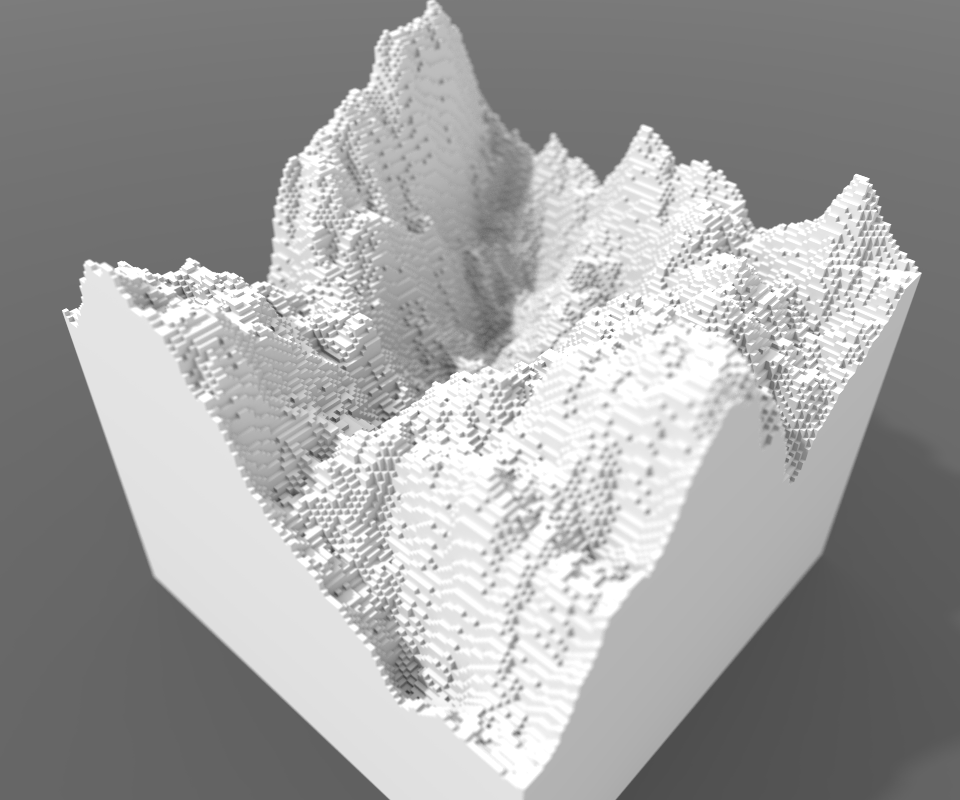</img></img>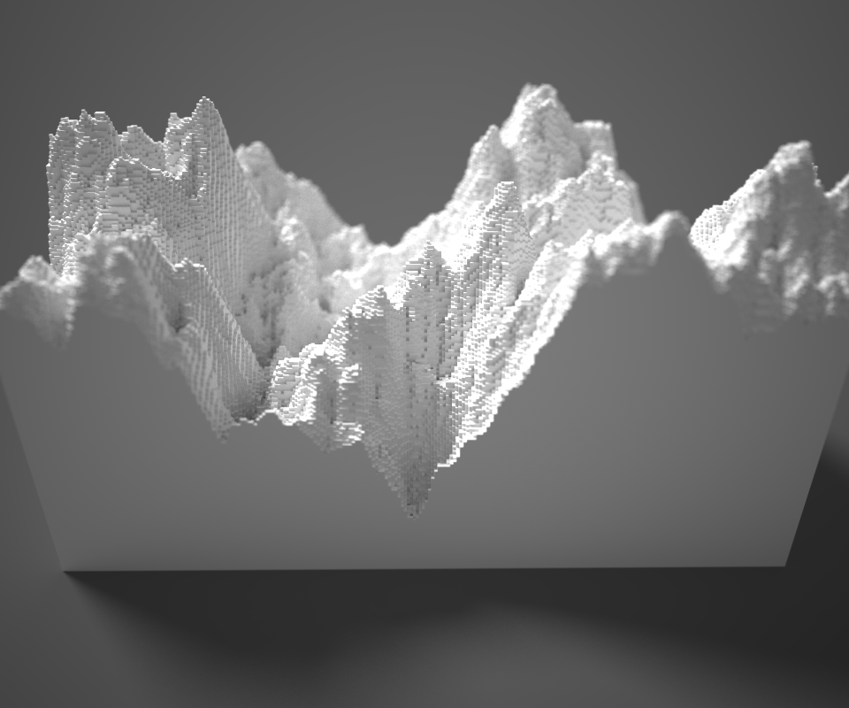</img>
### FLOW
<a href="#catalogue">Retour au catalogue</a>
> Ce shader imite la mécanique de l'écoulement de l'eau dans la nature.
* Nom de fichier: `flow.txt`
* Utilisation de la ligne de commande: `xs flow [color-index]`
* Ligne de commande: `xs flow 1`
>Les voxels avec un index donné sont source d'eau, le shader ne les créerait pas automatiquement, vous devez les attacher en premier.
* Aperçu de l'image:

  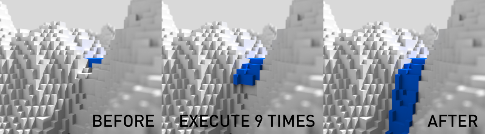</img>
### FLOW2
<a href="#catalogue">Retour au catalogue</a>
>Contrairement au shader classique, ce shader offre une solution pour les zones d'eau fermées.(fig.2)
* Nom de fichier: `flow2.txt`
* Utilisation de la ligne de commande: `xs flow2 [color-index]`
* Ligne de commande: `xs flow2 1`
>Les voxels avec un index donné sont source d'eau, le shader ne les créerait pas automatiquement, vous devez les attacher en premier.
* Aperçu de l'image:

  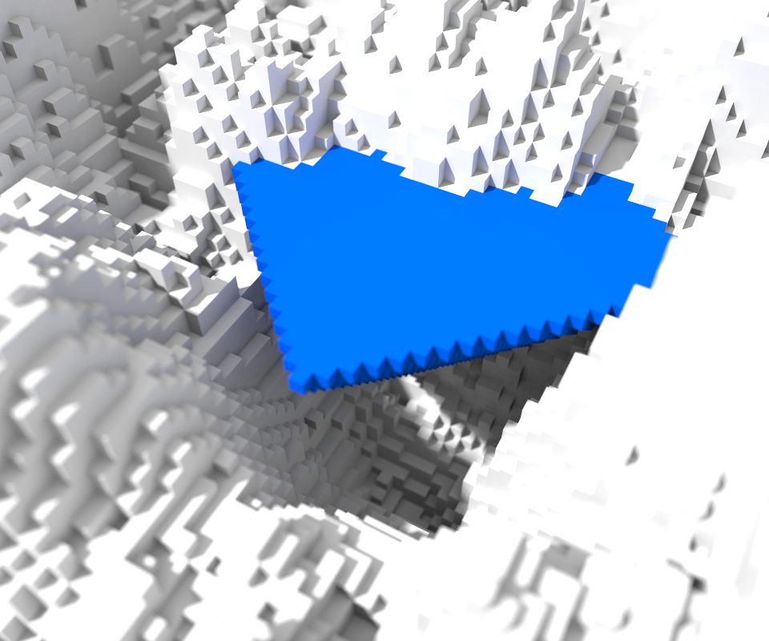</img>
  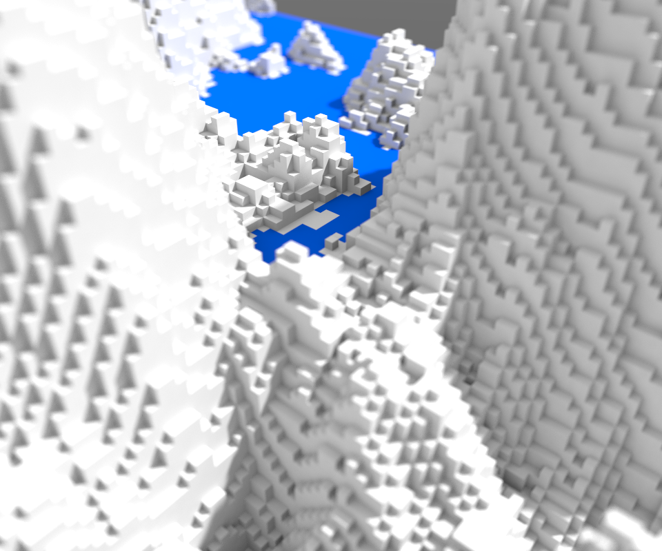</img>
### HYPERFLOOD
<a href="#catalogue">Retour au catalogue</a>
>**UNSTABLE ALLEZ DANS FLOW2 À LA PLACE.**

>Contrairement au shader classique, ce shader offre une solution pour les zones d'eau fermées.
* Nom de fichier: `hyperflood.txt`
* Utilisation de la ligne de commande: `xs hyperflood [x] [y] [z]` (Les paramètres représentent les coordonnées de la source d'eau.)
* Ligne de commande: `xs hyperflood 3 5 3`
>1. La couleur de l'eau est contrôlée par la couleur sélectionnée dans la palette.
>2. DANGER - LIRE AVANT UTILISATION 
 - LE SHADER NE SUPPORTE QUE LES SCÈNES AVEC MOINS DE 40 UNITÉS DE XYZ-VOLUMESIZE. (Vous pouvez modifier la ligne 17 pour supprimer la limite, mais réfléchissez d'abord). - LIMITÉ PAR L'EXPLICATIF INTÉRIEUR DE MAGICAVOXEL, LE SHADER N'EST PAS STABLE. SI L'ESPACE DE REMPLISSAGE EST TROP GRAND, MAGICAVOXEL PEUT S'ÉCRASER.
* Aperçu de l'image:

  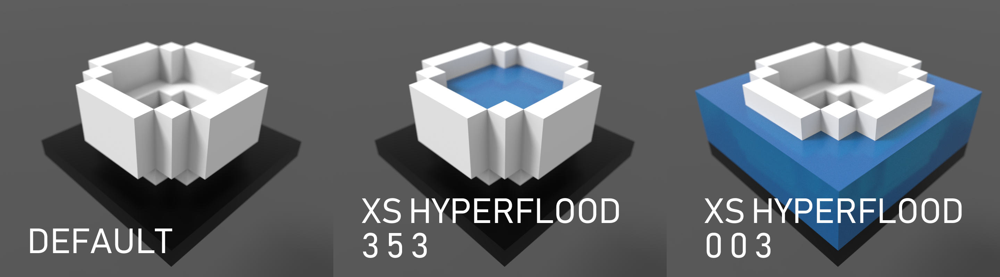</img>
### LIFE GAME
<a href="#catalogue">Retour au catalogue</a>
* Nom de fichier: `lifegame.txt`
* Utilisation de la ligne de commande: `xs lifegame [color-index]`
* Ligne de commande: `xs lifegame 1`
> Conçu pour le plan X-Y. Utilisez une seule couleur dans votre scène, ou le shader la détruira.
* Aperçu de l'image:

  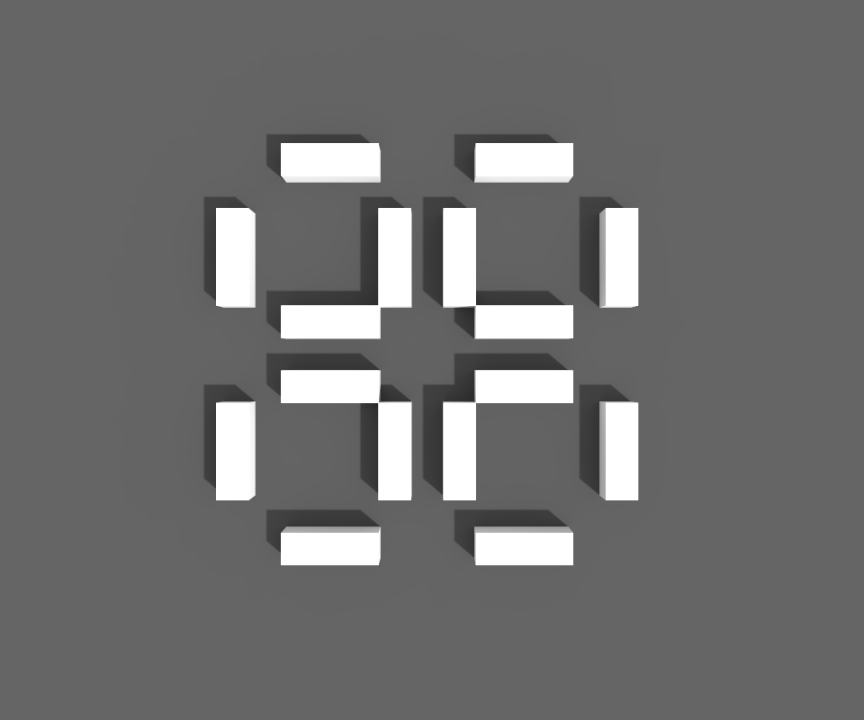</img>
  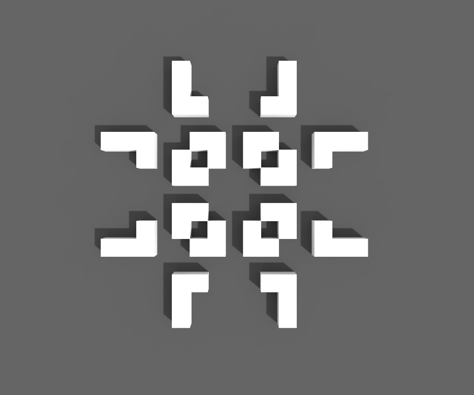</img>
  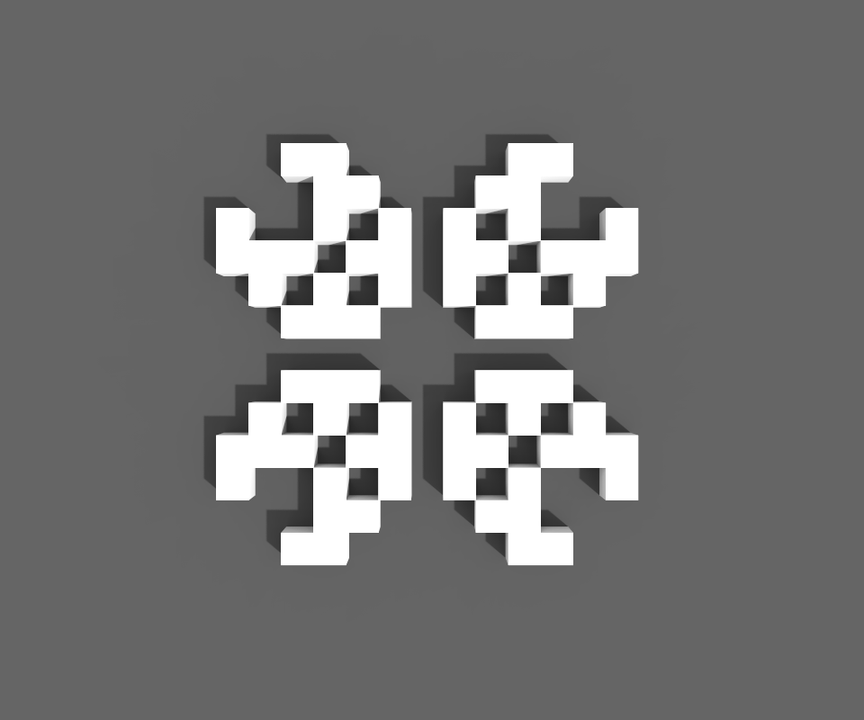</img>
### BLANKET
<a href="#catalogue">Retour au catalogue</a>
* Nom de fichier: `blanket.txt`
* Utilisation de la ligne de commandes: 
  `xs blanket [voxel-color] <noise-seed> <noise-scale> <threshold (0~2 recommend)>`
* Ligne de commande: `xs blanket 1 1248343 20 1.4`
* Edition minimale: `xs blanket 1`
>1. Le shader ne couvrira que les zones qui ne sont pas couvertes. (Comme la neige)
>2. Esp. si le générateur de terrain et l'ombrage de couverture ont les mêmes graines de bruit et la même échelle, et que le xyz-shifting du générateur de terrain est nul, le résultat des deux ombres mélangées ensemble sera comme la couverture de neige réaliste des hautes montagnes. (fig. 3)
* Aperçu de l'image:

  </img>
  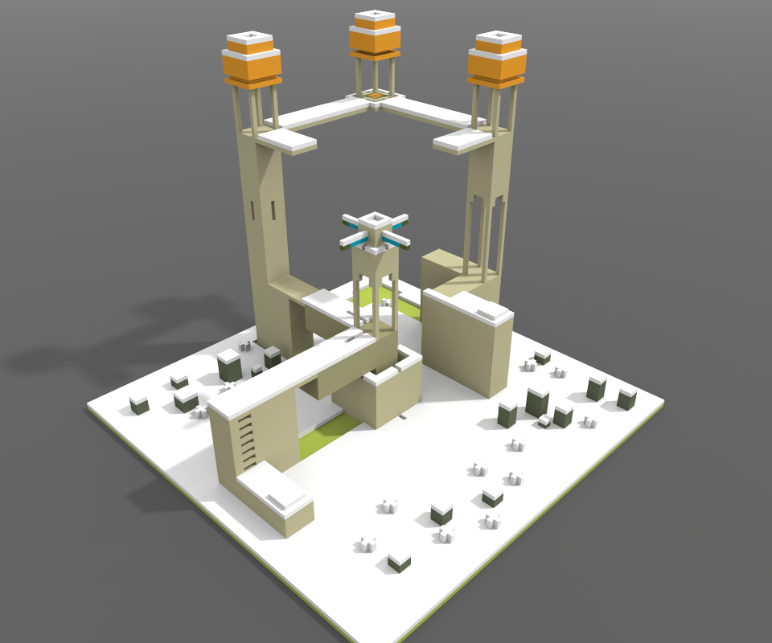</img>
  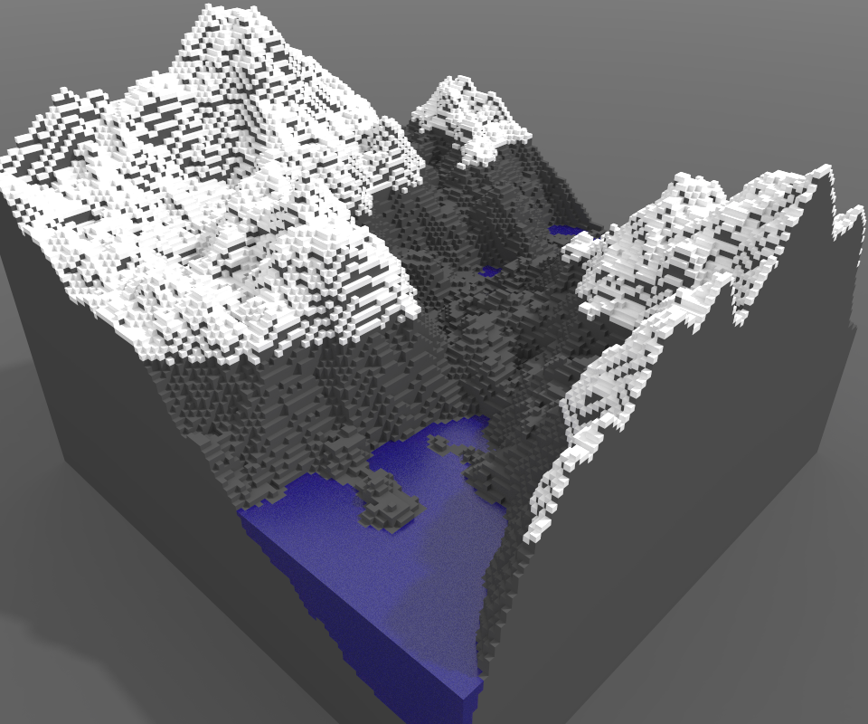</img>
### CUBE FILLING
<a href="#catalogue">Retour au catalogue</a>
* Nom de fichier: `cubefill.txt`
* Utilisation de la ligne de commandes:
  1. `xs cubefill [mode (0 for filling, 1 for frame)] [point1_X] [point1_Y] [point1_Z] [point2_X] [point2_Y] [point2_Z] [voxel color]`
  2. `xs cubefill [mode (0 for filling, 1 for frame)] [pointX] [pointY] [pointZ] [length of a side] [voxel color]`
* Ligne de commande:
  1. `xs cubefill 1 1 1 1 7 2 2 216` - Dessine le cadre du bord d'un cuboïde rouge entre les coordonnées (1,1,1) et (7,2,2).
  2. `xs cubefill 0 50 50 50 10 216` -  Prendre les coordonnées (50,50,50) comme centre, créer un cube rouge avec une longueur latérale de 10 unités.
* Aperçu de l'image:

  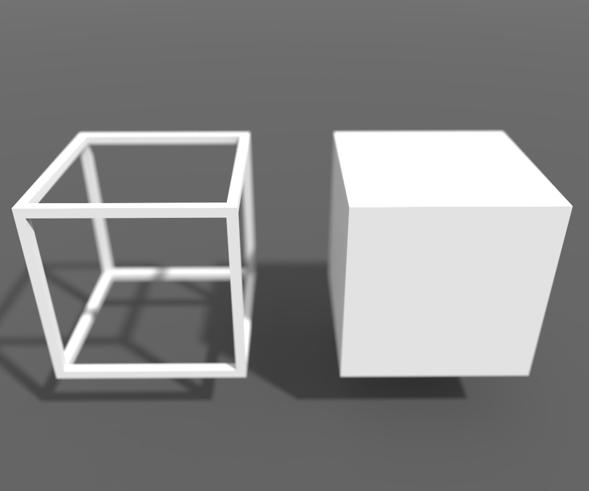</img>
### FLOOD
<a href="#catalogue">Retour au catalogue</a>
* Nom de fichier: `flood.txt`
* Utilisation de la ligne de commande: `xs flood [height] [color]`
* Ligne de commande: `xs flood 60 169`
>Ce shader n'est pas conçu pour des zones sélectionnées. (Ceci pourrait être amélioré dans les prochaines versions)
* Aperçu de l'image:

  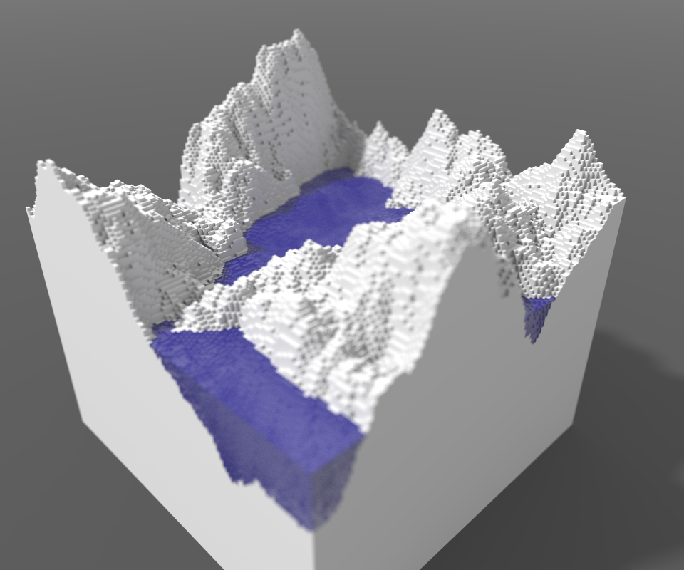</img>
### DARKER
<a href="#catalogue">Retour au catalogue</a>
* Nom de fichier: `darker.txt`
* Utilisation de la ligne de commande: `xs darker`
>1. Ce shader nécessite que vous mettiez l'id de la palette à 0.
>2. Ce shader n'est pas conçu pour des zones sélectionnées. (Ceci pourrait être amélioré dans les prochaines versions)
* Aperçu de l'image:

  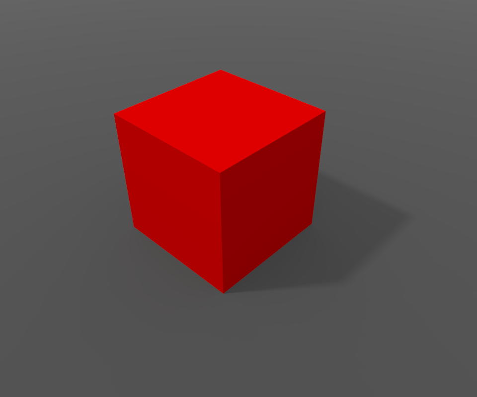</img>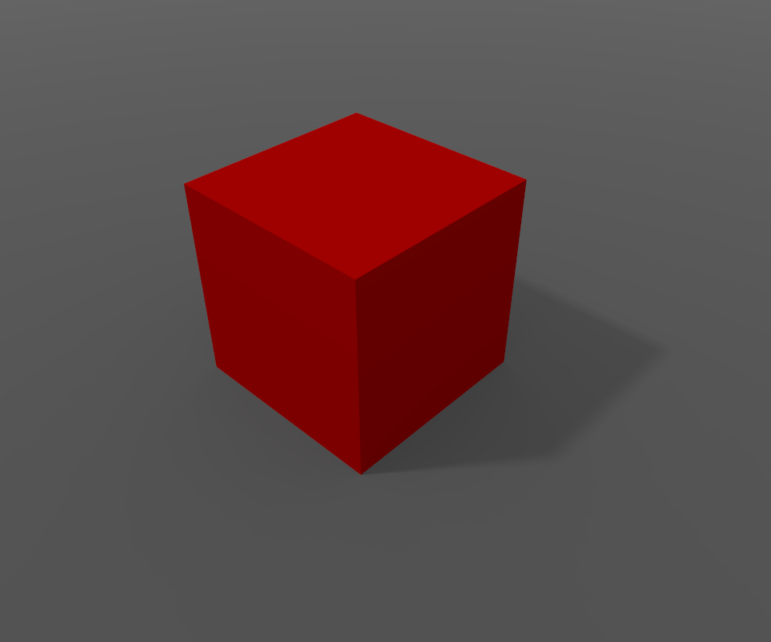</img>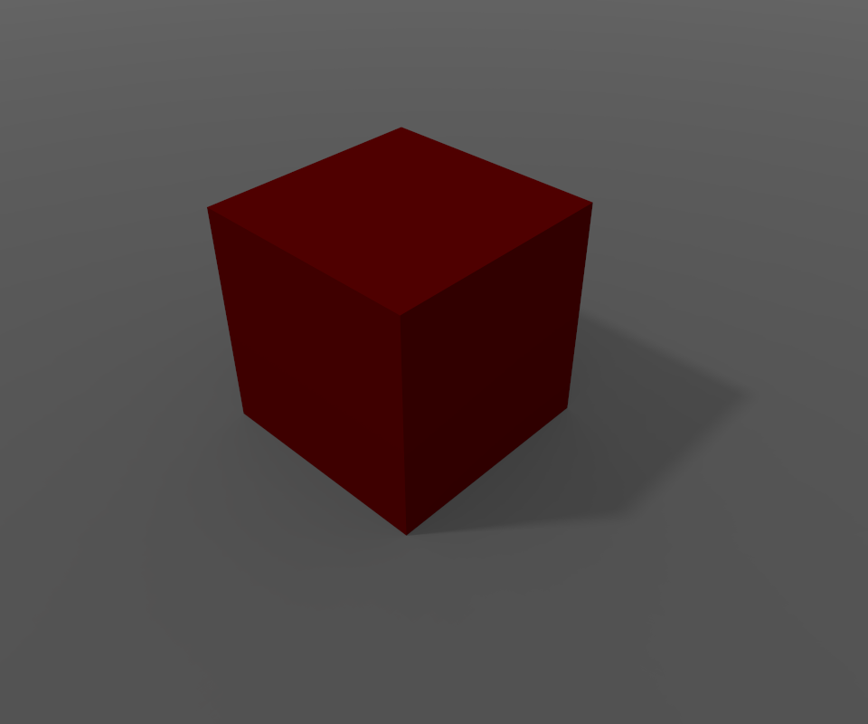</img>

