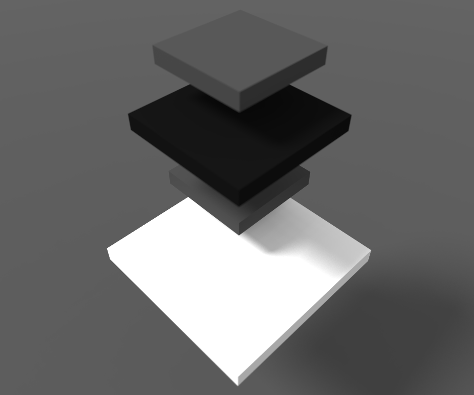
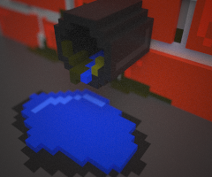
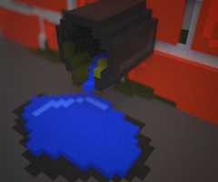

# Eric's MagicaVoxel Shaders
<a href="../README.md">Return</a>

**TRANSLATED BY <a href="http://github.com/codingeric">CODINGERIC</a>**

为MagicaVoxel设计的Shader，包含地形生成器，增强的洪流系统等。

## 项目信息
* 当前版本: `0.0.7.1`
* 状态: `长期支持`
* 使用 `MagicaVoxel 0.99.2 for Windows` 测试
* 在 `MIT License` 下发行
* 语言: `GLSL`

## 安装方法
将项目中 `shader` 文件夹中的 .txt 文件复制到您 MagicaVoxel 安装位置的 `shader` 文件夹中。

## 兼容性
>注意：GLSL的不兼容问题会被视为bug，欢迎在issue中提交。

| 版本 | 是否兼容 | 附注 |
| ------ | :------: | ------ |
| 0.98.2 | √ | 不支持世界系统 |
| 0.99 | √ | 无法在指令栏显示调色板 |
| 0.99.1 | √ | 无法在指令栏显示调色板 |
| 0.99.2 | √ | |

## Shader们和使用方法
>**注意**   - 具有 `<>` 的参数可以被忽略。多数时候，他们被默认设置为0。  - 除非特别说明，Shader们不支持选择区域处理。
### 
目录

* <a href="#terrain-generator">Terrain generator</a>
* <a href="#flow">Flow</a>
* <a href="#flow2">Flow2</a>
* <a href="#project">Project</a>
* <a href="#life-game">Life game</a>
* <a href="#drop">Drop</a>
* <a href="#blanket">Blanket</a>
* <a href="#cube-filling">Cube filling</a>
* <a href="#flood">Flood</a>
* <a href="#hyperflood">[Unstable] Hyperflood</a>
* <a href="#darker">Darker</a>
### TERRAIN GENERATOR
<a href="#index">回到目录</a>
* 文件名称: `tergen.txt`
* 命令行用法: `xs tergen [seed] [altitude] 
[noise-scale] [voxel-color] <void-voxel-color> <vertical-shifting> <x-shifting> <y-shifting>`
* 命令行用法示例: `xs tergen 19260817 50 20 1 0 -10 10 10`
* 命令行用法最简示例: `xs tergen 19260817 50 20 1`
>1. 推荐您把场景大小设置为126x126x126以获得最佳效果。
>2. 把 void-voxel-color 设置为 -1 将不会清空场景。
>3. 通过使用 MagicaVoxel0.99.x 的世界系统和本shader的xyz偏移选项，您将有机会创建一个如图3所示的大型地形图。
* 图片预览:

  </img></img></img>
### FLOW
<a href="#index">回到目录</a>
> 该shader模拟自然界中的水流效果。
* 文件名称: `flow.txt`
* 命令行用法: `xs flow [color-index]`
* 命令行用法示例: `xs flow 1`
>本shader会把参数给定的颜色作为全局水源，shader不会自动创建他们，请自己创建。
* 图片预览:

  </img>
### FLOW2
<a href="#index">回到目录</a>
> 这是 `hyperflood` 的替换实现。 在图2中您可以看见本shader提供了一个闭合水区的解决方案。
* 文件名称: `flow2.txt`
* 命令行用法: `xs flow2 [color-index]`
* 命令行用法示例: `xs flow2 1`
>本shader会把参数给定的颜色作为全局水源，shader不会自动创建他们，请自己创建。
* 图片预览:

  </img>
  </img>

### PROJECT
<a href="#index">回到目录</a>
>把给定 x-y 平面的颜色投射到其下方的表面上。
* 文件名称: `project.txt`
* 命令行用法: `xs project [height]`
* 命令行用法示例: `xs project 64`
>
* 图片预览:

  </img>
  </img>
### LIFE GAME
<a href="#index">回到目录</a>
* 文件名称: `lifegame.txt`
* 命令行用法: `xs lifegame [color-index]`
* 命令行用法示例: `xs lifegame 1`
> 为xy平面设计，请在你的场景中使用单色，否则Shader会摧毁他们。
* 图片预览:

  </img>
  </img>
  </img>
### DROP
<a href="#index">回到目录</a>
* 文件名称: `drop.txt`
* 命令行用法: `xs drop [color-index]`
* 命令行用法示例: `xs drop 1`
> 本shader模拟水滴过程。
* 图片预览:

  </img>
  </img>
  </img>
  </img>
  </img>
### BLANKET
<a href="#index">回到目录</a>
* 文件名称: `blanket.txt`
* 命令行用法s: 
  `xs blanket [voxel-color] <noise-seed> <noise-scale> <threshold (0~2 recommend)>`
* 命令行用法示例: `xs blanket 1 1248343 20 1.4`
* 命令行用法最简示例: `xs blanket 1`
>1. 地毯只会覆盖顶部无方块的区域 (像雪)。
>2. 特别地，如果地形生成器和本Shader使用了同一个噪声种子和大小，并且地形生成器没有偏移，如图3，两个Shader同时执行的效果将类似于雪被。
* 图片预览:

  </img>
  </img>
  </img>
### CUBE FILLING
<a href="#index">回到目录</a>
* 文件名称: `cubefill.txt`
* 命令行用法s:
  1. `xs cubefill [mode (0 for filling, 1 for frame)] [point1_X] [point1_Y] [point1_Z] [point2_X] [point2_Y] [point2_Z] [voxel color]`
  2. `xs cubefill [mode (0 for filling, 1 for frame)] [pointX] [pointY] [pointZ] [length of a side] [voxel color]`
* 命令行用法示例:
  1. `xs cubefill 1 1 1 1 7 2 2 216` - 在 (1,1,1) 和 (7,2,2) 之间绘制红色线框长方体。
  2. `xs cubefill 0 50 50 50 10 216` - 令 (50,50,50) 作为中心，创建一个边长为10的立方体。
* 图片预览:

  </img>
>本Shader不会清空场景。
### FLOOD
<a href="#index">回到目录</a>
* 文件名称: `flood.txt`
* 命令行用法: `xs flood [height] [color]`
* 命令行用法示例: `xs flood 60 169`
>
* 图片预览:

  </img>
### HYPERFLOOD
<a href="#index">回到目录</a>
>**不稳定 请使用FLOW2**

>与经典flood着色器不同，本shader提供了一个闭合水区的解决方案。
* 文件名称: `hyperflood.txt`
* 命令行用法: `xs hyperflood [x] [y] [z]` (参数指示了水源坐标)
* 命令行用法示例: `xs hyperflood 3 5 3`
>1. 水的颜色受到调色板控制
>2. 危险 - 用前读我
 - 本Shader只支持最大40x40x40的场景大小 (你可以更改代码的第17行改变限制，但这会使 MagicaVoxel 的着色器崩溃)
* 图片预览:

  </img>
### DARKER
<a href="#index">回到目录</a>
* 文件名称: `darker.txt`
* 命令行用法: `xs darker`
>本Shader要求您使用默认调色板0
* 图片预览:

  </img></img></img>

