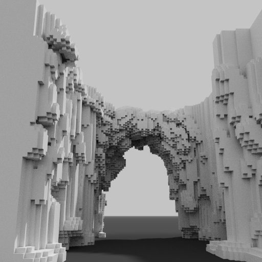
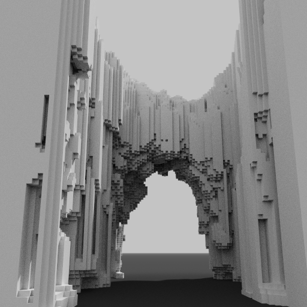
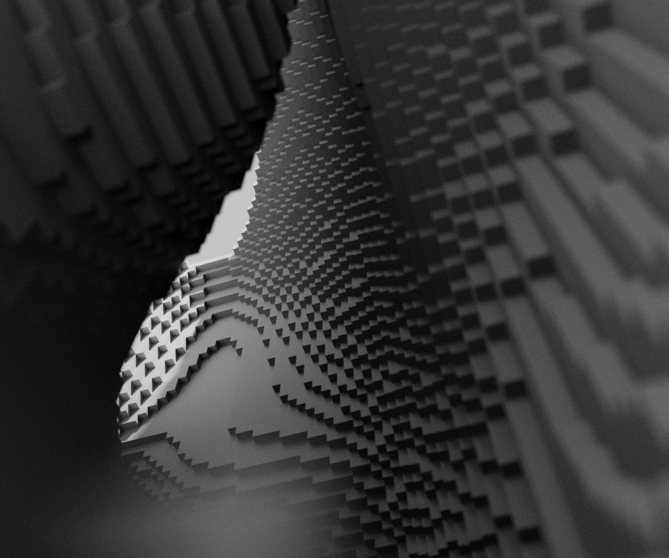
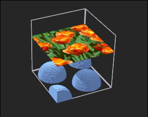

# Eric's MagicaVoxel Shaders

**TRANSLATED BY <a href="http://github.com/codingeric">CODINGERIC</a>**

也称为EMVS。

为MagicaVoxel设计的Shader，包含地形生成器，增强的洪流系统等。

## 项目信息

* 当前版本: `58`
* 在 `MIT License` 下发行

## 安装方法

将项目中 `shader` 文件夹中的 .txt 文件复制到您 MagicaVoxel 安装位置的 `shader` 文件夹中。

## 兼容性

| 版本 | 是否兼容 | 附注 |
| ------ | :------: | ------ |
| 0.99.5 及之前 | 在着色器版本55之后不再兼容 | |
| 0.99.5.1 及之后 | 所有着色器版本都兼容 | |

## 调试

参阅 <a href="https://github.com/CodingEric/Erics-MagicaVoxel-Shaders/issues/2#issuecomment-449905598">本issue</a>（英文）。

## 着色器和使用方法

从版本55开始，EMVS**不再**支持指令执行。请通过MagicaVoxel 0.99.5.1之后版本提供的图形化选项控制有关参数。

同时，由于图形化选项非常清晰，在这篇文档中不再提供对各个参数的解释。

### 
目录

* <a href="#tergen">tergen</a>
* <a href="#tergen2">tergen2</a>
* <a href="#tergen3">tergen3</a>
* <a href="#cave">cave</a>
* <a href="#flow">flow</a>
* <a href="#flow2">flow2</a>
* <a href="#project">project</a>
* <a href="#gol">gol</a>
* <a href="#drop">drop</a>

### tergen
<a href="#index">目录</a>

"tergen" 是一个二维的噪波生成器。

* 把 Air Color 设置为 -1 ，没有地形的体素区域不会被破坏，但是有地形的体素区域内，原有的体素会被地形替换。
* 把 Air Color 设置为 -2 ，所有已经存在于场景的体素都不会被破坏。

### tergen2
<a href="#index">目录</a>

"tergen2" 是 "tergen" 的修改版本，使您能够仅在已有的体素上方创建地形。

### tergen3
<a href="#index">index</a>

"tergen3" 是 "cave" 的修改版本，但生成的是二维的地形，这使您能够在时间参数的参与下创建噪波动画。

### cave
<a href="#index">目录</a>

"cave" 是一个三维空间的噪波生成器。

把 Air Color 设置为 -1 可以不破坏原有的体素。

### flow
<a href="#index">目录</a>

"flow" 模拟自然界中水体下流的过程。

* 您可以把 Iteration 设置到一个值来简化执行次数。
* 着色器不会自动创建水源，请您预先创建。

### flow2
<a href="#index">目录</a>

"flow2" 是 "flow" 的修改版本，通过重复执行该着色器，您可以在一个封闭区域填充水体，并且不会溢出到外部。

* 您可以把 Iteration 设置到一个值来简化执行次数。
* 着色器不会自动创建水源，请您预先创建。

### project
<a href="#index">目录</a>

"project" 使您能够把某个2d平面投影到其下方的3d物体上。

### gol
<a href="#index">目录</a>

"gol" 是康威的生命游戏。

本着色器只能在x-y平面上执行，而且如果场景中出现多种颜色，可能会遇到问题。

### drop
<a href="#index">目录</a>

"drop" 在单次执行中，把悬空的体素下移一格。

